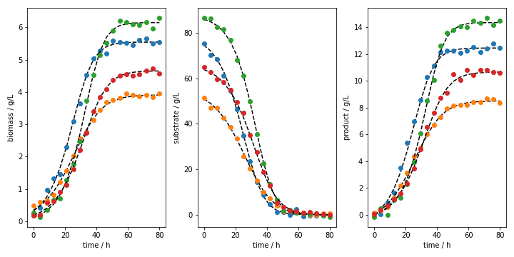
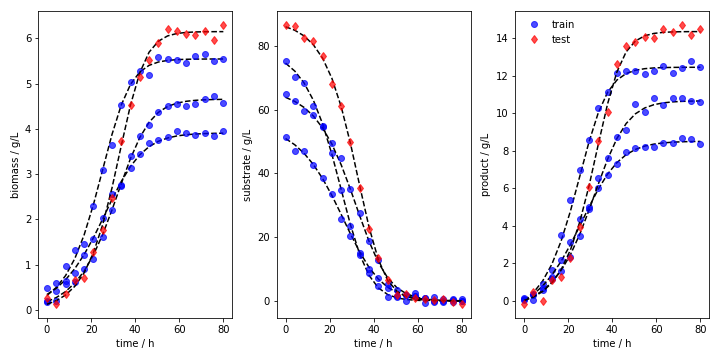
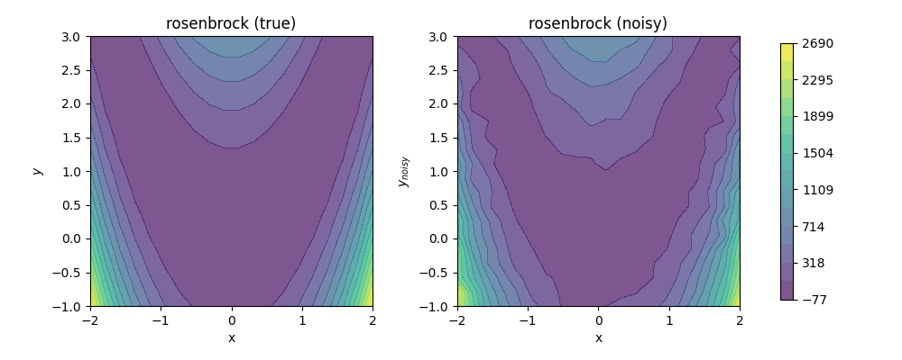
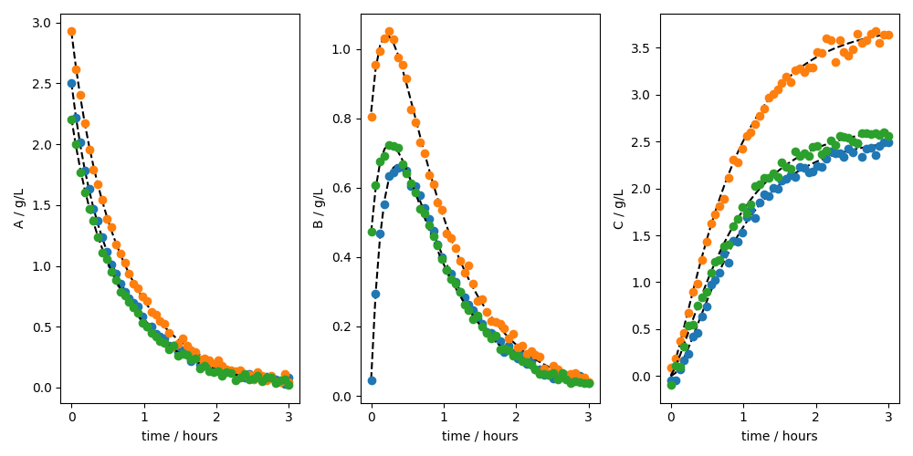

In-Silico Data Generation in Python (InSiDa-Py)
================================================

|RTD|

This package is used to simplify the generation of example data for different case studies. In several applications, for example in the field of surrogate modeling, it is necessary to generate some *in-silico* data which can be used to train a model. The tool simplifies the generation and export of such data. Some cited applications are included, where the user can easily create custom systems as shown below.

..
- [Installation](#installation) 💻
- [Included tools](#included-tools) 🧰
- [Examples](#examples) ⚗️
  * [Bioreactor in batch operation mode](#bioreactor-in-batch-operation-mode)
  * [Rosenbrock function](#rosenbrock-function)
  * [Custom ODE system](#custom-ode)
- [References](#references) 📚
- [Contribute](#contribute)

Installation
------------
If you are a git user, try to install the package using the following command:

.. code-block:: text

    pip install git+https://github.com/forstertim/insidapy.git

Alternatively, you can clone the repository and install it. To easily add your own case studies, install in developer mode (`-e` in the pip install command):

.. code-block:: text

    git clone https://github.com/forstertim/insidapy.git
    cd insidapy
    pip install -e .

If you do not use git, above, click the button `Code` and select Download ZIP. Unzip the files and store the folder in a place of your choice. Open a terminal inside that folder (you should see the `setup.py` file). Run the following command in the terminal:

.. code-block:: text

    pip install -e .

By using `pip list`, you should see the package installed in your environment (together with the path to the corresponding folder in case you used the developer mode).

Included tools
--------------
The simulator includes several options to generate data:

* **Univariate**: Data for some univariate functions can be generated. By choosing one of the examples in the univariate class, the method automatically generates the ground truth and noisy data according to the user's input. Currently, the following functions to generate noisy data are implemented:
    * *`sin`* (default): Sinusoidal function $y=\sin(x)$.
    * *`logistic`*: Logistic function $y=1/(1+\exp(x))$.

* **Multivariate**: Data for some multivariate functions can be generated. By choosing one of the examples in the multivariate class, the method automatically generates the ground truth and noisy data according to the user's input. Currently, the following functions to generate noisy data are implemented:
    * *`rosenbrock`* (default): The Rosenbrock function is simulated. Useful for optimization benchmarking. The function takes the following form: $f(x,y)=(a-x)^{2}+b(y-x^{2})^{2}$. This function was included in this module after using it in the work of [Forster et al. (2023a)](#references).

* **ODE**: The available classes are `batch`, `fedbatch`, and `custom_ode`. All of them implement an ODE solver for different case studies. Some examples of the implemented case studies are the following (the currently implemted examples are visible by loading the class (`batch` or `fedbatch`) and using the `show_implemented_examples()` function)

    * **`batch`**:
        * *`batch1`* (default): Batch fermentation process with three species based on the work of [Turton et al. (2018)](#references) and used in [Forster et al. (2023b)](#references). 
        * *`batch2`*: Batch fermentation process with four species based on the work of [Del Rio‐Chanona et al. (2019)](#references). 
        * *`batch3`*: Michaelis-Menten kinetics and four species. Example was adapted from [Wong et al. (2023)](#references)
        * *`batchX`*: Several examples (currently X={4,5}) for chemical reactions or reaction networks. Reference information is displayed upon loading the class and printing the information by using the `print_info()` function. Most examples were taken from [Floudas et al. (1999)](#references)
    
    * **`fedbatch`**:
        * *`fedbatch1`*: Example was taken from [Seborg et al. (2016)](#references)
   
    * **`custom_ode`**:
        * The user can store a separate function file with a system of ODEs. The function can take additional parameters as inputs or not (i.e., `def ODE(y,t)` or `def ODE(y,t,coefs)`). This allows to easily set up a custom case study. An example is shown below. If not explicitly stated, the module assumes the first structure of the ODE file (no additional inputs).

By choosing one of the examples in this class, the method automatically generates the ground truth and noisy data according to the user's input.

Examples
--------

Bioreactor in batch operation mode
^^^^^^^^^^^^^^^^^^^^^^^^^^^^^^^^^^
The example code is stored in `examples/main_batch_fermentation_example.py`.

First, the `batch` class is loaded:

.. code-block:: python
    
    from insidapy.ode import batch

Then, the data object is instantiated with the chosen settings. Here, four different batches are simulated (four different initial conditions). The different initial conditions are generated by an LHS (Latin Hypercube Sampling) approach. The batches include the given number of points per batch (samples per species per batch). After that, 2.5% noise is added. The simulator includes default case studies. However, the user can choose to overwrite the default upper and lower bounds for the generation of the initial conditions (shown below). Also, the user can overwrite the default time span for the integration of the ODEs.

First, one can load the class and check the available examples that are implemented by default:

.. code-block:: text

    batch().show_implemented_examples()

    Output:
    +----------------------+----------------------------------------------------------------------------------+
    |  Example ID string   | Description                                                                      |
    +----------------------+----------------------------------------------------------------------------------+
    |        batch1        | Batch fermentation with 3 species. Bacteria growth, substrate consumption and    |
    |                      | product formation. Mimics the production of a target protein.                    |
    |        batch2        | Batch fermentation with 4 species. Bacteria growth, nitrate/carbon/phosphate     |
    |                      | consumption. Mimics a waste water treatment process.                             |
    |        batch3        | Enzyme substrate interaction described by the Michaelis-Menten model. 4 species. |
    |                      | E + S <-[k1],[ki1]-> ES ->[k2] E + P                                             |
    |        batch4        | Series of reactions. 3 Species. A -[k1]-> B -[k2]-> C.                           |
    |        batch5        | Van de Vusse reaction. 4 Species. A -[k1]-> B -[k2]-> C and 2 A -[k3]-> D.       |
    +----------------------+----------------------------------------------------------------------------------+

**Note**: If the `fedbatch` class is loaded, other examples are displayed, although the fedbatch-class relies on the batch-class.

After choosing an example, one can load it with more detailed settings by using the corresponding ID string:

.. code-block:: python
    data = batch(   example='batch1',                                       # Choose example. Defaults to "batch1" (fermentation with 3 species).
                    nbatches=4,                                             # Number of batches. Defaults to 3.
                    npoints_per_batch=20,                                   # Number of points per batch and per species. Defaults to 20.
                    noise_mode='percentage',                                # Noise mode. Defaults to "percentage".
                    noise_percentage=2.5,                                   # Noise percentage (in case mode is "percentage")      
                    random_seed=10,                                         # Random seed for reproducibility. Defaults to 0.
                    bounds_initial_conditions=[[0.1, 50, 0], [0.4, 90, 0]], # Bounds for initial conditions. Defaults to "None".
                    time_span=[0, 80],                                      # Time span for integration. Defaults to "None". 
                    initial_condition_generation_method='LHS',              # Method for generating initial conditions. Defaults to "LHS".
                    name_of_time_vector='time')                             # Name of time vector. Defaults to "time".

The information about the example - including a reference (i.e., a DOI or ISBN) can be printed to the console:

.. code-block:: text
    data.print_info()

    Output:
    +--------------------------------+------------------------------------------------------------------------+
    | Property                       | Description                                                            |
    +--------------------------------+------------------------------------------------------------------------+
    | Example string                 | batch1                                                                 |
    | Example description            | Batch fermentation with 3 species. Bacteria growth, substrate          |
    |                                | consumption and product formation. Mimics the production of a target   |
    |                                | protein.                                                               |
    | Short reference information    | ISBN 0-13-512966-4                                                     |
    | Number of species              | 3                                                                      |
    | Species names                  | ['biomass', 'substrate', 'product']                                    |
    | Species units                  | ['g/L', 'g/L', 'g/L']                                                  |
    | Number of batches              | 4                                                                      |
    | Number of samples              | 20                                                                     |
    | Time span                      | [0, 80]                                                                |
    | Time unit                      | h                                                                      |
    | Noise mode                     | percentage                                                             |
    | Noise percentage               | 2.5%                                                                   |
    | Lower bounds for experiments   | [0.1, 50.0, 0.0]                                                       |
    | Upper bounds for experiments   | [0.4, 90.0, 0.0]                                                       |
    +--------------------------------+------------------------------------------------------------------------+

Then, the batch experiments are run:

.. code-block:: python
    data.run_experiments()

Most modeling approaches require a training dataset and a separate testing dataset. To generate separate datasets, the user can apply a splitting in an sklearn-manner. There is no default value set. In case the user calls the function, a `test_splitratio` in the range [0,1) needs to be chosen. The value represents the fraction of the total number of batches generated used for the test set. The data is then splitted and stored in the data object as `data.training` and `data.testing`. 

.. code-block:: python
    data.train_test_split(test_splitratio=0.2)

One can subsequently plot the batches in different ways. The resulting figures are shown as Figure 1 and 2 below. The option of saving the plot is included. The figure extensions and directory can be chosen.

.. code-block:: python
    # Plot batches
    data.plot_experiments(  save=True, 
                            show= False, 
                            figname=f'{data.example}_simulated_batches',
                            save_figure_directory=r'.\figures', 
                            save_figure_exensions=['png'])

    # Plot batches and make training and testing batches visually distinguishable
    data.plot_train_test_experiments(   save=True, 
                                        show=False,
                                        figname=f'{data.example}_simulated_batches_train_test',
                                        save_figure_directory=r'.\figures', 
                                        save_figure_exensions=['png'])

*Fig 1. Example several runs in batch operation mode (batch1 example).*

*Fig 2. Example several runs in batch operation mode (batch1 example) with training and testing batches visualized differently.*

After the simulation, one can export the data as XLSX files. By choosing `which_dataset` to be `training` (only executable if `train_test_split` was applied), `testing` (only executable if `train_test_split` was applied), or `all` (always executable), the corresponding data is exported to the indicated location:

.. code-block:: python
    data.export_dict_data_to_excel(destination=r'.\data', which_dataset='all')      # Exports all the data
    data.export_dict_data_to_excel(destination=r'.\data', which_dataset='training') # Exports the training data (blue circles in Fig 2)
    data.export_dict_data_to_excel(destination=r'.\data', which_dataset='testing')  # Exports the training data (red diamonds in Fig 2)

Rosenbrock function
^^^^^^^^^^^^^^^^^^^

The example code is stored in `examples/main_multivariate_examples.py`.

First, the `multivariate_examples` class is loaded:

.. code-block:: python
    from insidapy.multivariate import multivariate_examples

Then, the data object is instantiated with the chosen settings. Here, The Rosenbrock function is simulated. The user can pass chosen coefficients. If that is not done, the default coefficients are taken. After that, 10% noise is added.

.. code-block:: python
    data = multivariate_examples(   example='rosenbrock',
                                    coefs=[1, 100], 
                                    npoints=20, 
                                    noise_mode='percentage', 
                                    noise_percentage=10)

One can then plot the contour of the function by also choosing the number of level curves. The resulting figure is shown as Figure 3 below. The option of saving the plot is included, where one can also choose the figure extensions and destination path. In case the script is executed several times, the input `show` can be set to false to not show the figure every time. 

.. code-block:: python
    data.contour_plot_2_variables(  nlevels=15, 
                                    show=False,
                                    save=True, 
                                    save_figure_directory=r'.\figures', 
                                    save_figure_exensions=['png'])

After the simulation, one can export the data as XLSX files. The destination folder can be chosen by `destination`. The filenames are automatically set to `{example}_data.xlsx` and `{example}_data_noisy.xlsx`.

.. code-block:: python  
    data.export_to_excel(destination=r'.\data')

*Fig 3. Example of the Rosenbrock function.*

Custom ODE
^^^^^^^^^^
Two examples are stored in `examples/main_custom_ode_with_arguments_passing.py` and `examples/main_custom_ode_without_arguments_passing.py`.

First, the `custom_ode` class is loaded:

.. code-block:: python  
    from insidapy.ode import custom_ode

Then, the user can define where the separate file with the ODE system is located:

.. code-block:: python  
    # Define where the ODE file is located and how the ODE function is called
    CUSTOM_ODE_RELATIVE_PATH = '.'
    CUSTOM_ODE_FILENAME = 'customodefile_with_args'
    CUSTOM_ODE_FUNC_NAME = 'customode'

Additionally, the user can either add additional parameters that should be passed to the function file by using the `ode_arguments` input or not. The following example shows the case where additional parameters are passed to the ODE file. The example is stored in `examples/main_custom_ode_with_arguments_passing.py` and the separate ODE file is located in `examples/customodefile_with_args`:

.. code-block:: python  
    # Give information about the ODE system
    CUSTOM_ODE_SPECIES = ['A', 'B', 'C']
    CUSTOM_ODE_TSPAN = [0, 3]
    CUSTOM_ODE_BOUNDS_INITIAL_CONDITIONS = [[2, 0, 0], [3, 1, 0]]
    CUSTOM_ODE_ARGUMENTS = {'k1': 2, 'k2': 1, 'k3': 3}

    # Define the units of the ODE system
    CUSTOM_ODE_NAME_OF_TIME_UNIT = 'hours'
    CUSTOM_ODE_NAME_OF_SPECIES_UNITS = ['g/L', 'g/L', 'g/L']

The separate ODE file could look for example like this:

.. code-block:: python  
    import numpy as np

    def customode(y, t, coefs):
            """Custom ODE system. A batch reactor is modeled with two species. The following system
            is implemented: A <-[k1],[k2]-> B -[k3]-> C

            Args:
                y (array): Concentration of species of shape [n,].
                t (scalar): time.
                coefs (dict): Dictionary of coefficients or other information.

            Returns:
                array: dydt - Derivative of the species of shape [n,].
            """
        
            # Variables  
            A = y[0]
            B = y[1]
            C = y[2]

            # Parameters
            k1 = coefs['k1']
            k2 = coefs['k2']
            k3 = coefs['k3']    

            # Rate expressions
            dAdt = k2*B - k1*A
            dBdt = k1*A - k2*B - k3*B
            dCdt = k3*B

            # Vectorization
            dydt = np.array((dAdt, dBdt, dCdt))

            # Return
            return dydt.reshape(-1,)    

Similar to the `batch`-class example above, the instance is created (in case no additional arguments should be passed to the separate ODE function, just ommit the parameter `ode_arguments` and create the separate function file only by `def ODE(y,t)`):

.. code-block:: python  
    data = custom_batch_ode(filename_custom_ode=CUSTOM_ODE_FILENAME,                        #Filename of the file containing the ODE system.
                            relative_path_custom_ode=CUSTOM_ODE_RELATIVE_PATH,              #Relative path to the file containing the ODE system.
                            custom_ode_function_name=CUSTOM_ODE_FUNC_NAME,                  #Name of the ODE function in the file.
                            species=CUSTOM_ODE_SPECIES,                                     #List of species.
                            bounds_initial_conditions=CUSTOM_ODE_BOUNDS_INITIAL_CONDITIONS, #Bounds for initial conditions.
                            time_span=CUSTOM_ODE_TSPAN,                                     #Time span for integration.
                            ode_arguments=CUSTOM_ODE_ARGUMENTS,                             #Arguments of the ODE system. Defaults to "None".
                            name_of_time_unit=CUSTOM_ODE_NAME_OF_TIME_UNIT,                 #Name of time unit. Defaults to "h".
                            name_of_species_units=CUSTOM_ODE_NAME_OF_SPECIES_UNITS,         #Name of species unit. Defaults to "g/L".
                            nbatches=3,                                                     #Number of batches. Defaults to 1.
                            npoints_per_batch=50,                                           #Number of points per batch and per species. Defaults to 50.
                            noise_mode='percentage',                                        #Noise mode. Defaults to "percentage".
                            noise_percentage=2.5,                                           #Noise percentage (in case mode is "percentage"). Defaults to 5%.      
                            random_seed=0,                                                  #Random seed for reproducibility. Defaults to 0.
                            initial_condition_generation_method='LHS',                      #Method for generating initial conditions. Defaults to "LHS".
                            name_of_time_vector='time')                                     #Name of time vector. Defaults to "time".

And the experiments are run:

.. code-block:: python  
    data.run_experiments()

Similarly, plotting can be done and the data could be splitted (train/test) and exported as XLSX files.

.. code-block:: python  
    data.plot_experiments(  show=True,
                            save=True, 
                            figname='custom_odes_with_args', 
                            save_figure_directory=r'.\figures', 
                            save_figure_exensions=['png'])

*Fig 4. Example of the simulation of a custom ODE file.*

References
----------

-   **Del Rio-Chanona E.A., Cong X., Bradford E., Zhang D., Jing K.**, 
    Review of advanced physical and data-driven models for dynamic bioprocess simulation: Case study of algae–bacteria consortium wastewater treatment. 
    *Biotechnology and Bioengineering*. **2019**.
    `[URL] <https://onlinelibrary.wiley.com/doi/abs/10.1002/bit.26881>`__

> **Floudas C.A., Pardalos P.M., Adjiman C.S., Esposito W.R., Gümüs Z.H**, Handbook of Test Problems in Local and Global Optimization. *In: Series Title: Nonconvex Optimization and Its Applications*. **1999**, Springer US. ISBN 978-1-4419-4812-0.

> **Forster T., Vázquez D., Guillén-Gosálbez G.**, Global optimization of symbolic surrogate process models based on Bayesian learning. **2023a**. *Computer Aided Chemical Engineering*. [URL](https://www.sciencedirect.com/science/article/abs/pii/B9780443152740501980)

> **Forster T., Vázquez D., Cruz-Bournazou M.N., Butté A., Guillén-Gosálbez G.**, Modeling of bioprocesses via MINLP-based symbolic regression of S-system formalisms. **2023b**. *Computers & Chemical Engineering*. [URL](https://www.sciencedirect.com/science/article/pii/S0098135422004410)

> **Seborg D.E., Edgar F.T., Mellichamp D.A., Doyle F.J.**, Process Dynamics and Control, 4th edition. *2016*, Wiley. ISBN: 978-1-119-28591-5.

> **Turton R., Shaeiwtz J.A., Bhattacharyya D., Whiting W.B.**, Analysis, synthesis and design of chemical processes, 5th Edition, **2018**, Prentice Hall. ISBN 0-13-512966-4.

> **Wong S.W.K., Yang S., and Kou S.C.**, Estimating and Assessing Differential Equation Models with Time-Course Data. **2023**. *J Phys Chem B. 2023*. [URL](https://pubs.acs.org/doi/10.1021/acs.jpcb.2c08932)

Contribute
----------
If you have other interesting examples that you would like to have implemented, raise an issue with a reference to the example (i.e., a DOI to a paper with the system). There is a template for such an issue which you can use. Another option is to implement the example yourself and raise a pull request. The same applies to bugs or other issues. 

.. |RTD| image:: https://readthedocs.org/projects/insidapy/badge/?version=latest
    :target: https://insidapy.readthedocs.io/en/latest/?badge=latest
    :alt: Documentation Status